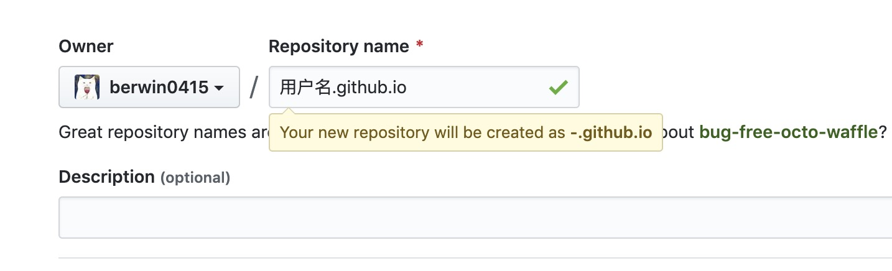

# GitHub Pages

## 什么是Github Pages

Websites for you and your projects.

Hosted directly from your GitHub repository. Just edit, push, and your changes are live.

## 步骤一：创建pages仓库

在github创建项目仓库，仓库名为 用户名.github.io

## 步骤二：Clone 项目 并新增index.html

clone项目至本地，新增index.html后推送至远程仓库

## 步骤三：打开 github.io

打开 用户名.github.io

## All Down

至此Github Pages就创建完成啦！
