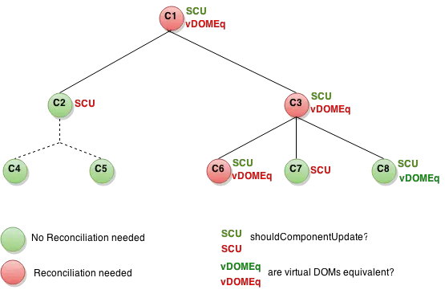

# immutable 数据流

## 前置：react Reconciliation 及 diff 策略


如上图所示，React 采用的是虚拟 DOM (即 VDOM )，每次属性 (props) 和状态 (state) 发生变化的时候，render 函数返回不同的元素树，React 会检测当前返回的元素树和上次渲染的元素树之前的差异，然后针对差异的地方进行更新操作，最后渲染为真实 DOM，这就是整个 Reconciliation 过程，其核心就是进行新旧 DOM 树对比的 diff 算法。

为了获得更优秀的性能，首当其冲的工作便是`减少 diff`的过程，那么在保证应该更新的节点能够得到更新的前提下，这个 diff 的过程如何来避免呢？

答案是利用 shouldComponentUpdate 这个生命周期函数。

#### 例子

下面以 React 官方的一个图为例，完整地分析一下 Reconciliation 的流程:


SCU 即 shouldComponentUpdate 的简写，图中的红色节点表示 shouldComponentUpdate 函数返回 true ，需要调用 render 方法，进行新旧 VDOM 树的 diff 过程，绿色节点表示此函数返回 false ，不需要进行 DOM 树的更新。

从 C1 开始，C1 为红色节点，shouldComponentUpdate 返回 true，需要进行进一步的新旧 VDOM 树的比对，假设现在两棵树上的 C1 节点类型相同，则递归进入下一层节点的比较，首先进入 C2，绿色节点，表示 SCU 返回 false，不需要对 C2 的 VDOM 节点进行比对，同时 C2 下面所有的后代节点 都不需要比对。

现在进入 C3，C3 为红色节点，表示 SCU 为 true，需要在该节点上进行比对，假设两棵树的 C3 节点类型相同，则继续进入到下一层的比对中。其 r 中 C6 为红色节点，进行相应的 diff 操作，C7、C8 都为绿色节点，都不需要更新。

#### React 虚拟 DOM 的 Diff 算法


## 一、什么是 immutable 数据

### mutable 数据

与 immutable 数据相对的是 mutable 数据，即可变的数据结构

```js
var obj = {
  a: "a1",
};

var obj1 = obj;

obj1.a = "b1";

console.log(obj.a); // b1
```

js 在创建变量、赋值后是可变的。除了基本类型，其他的引用类型，通过变量地址来共享。

改变了 obj1.a 的值，同时也会改变 obj.a 的值。其实改变的是同一个对象引用。这样共享地址来共享值的好处是节省内存，坏处是稍微不注意就会导致改 A 坏 B 的棘手问题。

### immutable 数据

immutable 数据一种利用结构共享形成的持久化数据结构。Immutable 就是在创建变量、赋值后便不可更改，若对其有任何变更，就会回传一个新值，并且原来相同的节点会直接共享。


## 二、为什么在 react 中使用 immutable 数据

shouldComponentUpdate 是我们进行 react 性能优化的利器，很多优化方案都会基于它来进行。

### 优化方案一：PureComponent (memo) 进行浅层比较

问题：只会比较引用类型的引用是否相等

### 优化方案二：shouldComponentUpdate 中进行深层比对

在 shouldComponentUpdate 函数中进行递归对比，这样就达到了深层对比的效果。

但是想想一种极端的情况，就是在属性有一万条的时候，只有最后一个属性发生了变化，那我们就不得已将一万条属性都遍历。这是非常浪费性能的。

### 优化方案二：immutable 数据结构 + SCU (memo) 浅层比对

回到问题的本质，无论是直接用浅层比对，还是进行深层比对，我们最终是想知道组件的 props (或 state) 数据有无发生改变。

在这样的条件下，immutable 数据应运而生。

## 三、如何使用 immutable 数据

Immutable 只是一个定义，有各种实现，Immutable.js 就是 facebook 工程师的一个实现。

但是 ImmutableJS 有两个较大的不足：

- 与原生 js 的数据结构差异巨大，需要使用者学习它的数据结构操作方式；
- 它的操作结果需要通过 toJS 方法才能得到原生对象，这使得在操作一个对象的时候，时刻要注意操作的是原生对象还是 ImmutableJS 的返回结果，稍不注意，就会产生意想不到的 bug。

故我们这里介绍 Immutable 的另一个实现，`immer`。

`Immer` 是 mobx 的作者写的一个 immutable 库，核心实现是利用 ES6 的 proxy，几乎以最小的成本实现了 js 的不可变数据结构，简单易用、体量小巧、设计巧妙，满足了我们对 JS 不可变数据结构的需求。

### 如何使用 immer

immer 默认暴露一个 produce 函数去完成所有工作。

```js
import produce from "immer";
```

or

```js
import { produce } from "immer";
```

#### 使用方式

```js
produce(currentState, recipe: (draftState) => void | draftState, ?PatchListener): nextState
// or
produce(recipe: (draftState) => void | draftState, ?PatchListener)(currentState): nextState
```

#### 概念说明

Immer 涉及概念不多，在此将涉及到的概念先行罗列出来，阅读本文章过程中遇到不明白的概念，可以随时来此处查阅。

- `currentState` 被操作对象的最初状态
- `draftState` 根据 currentState 生成的草稿状态，它是 currentState 的代理，对 draftState 所做的任何修改都将被记录并用于生成 nextState 。在此过程中，currentState 将不受影响
- `nextState` 根据 draftState 生成的最终状态
- `produce` 生产 用来生成 nextState 或 producer 的函数
- `producer` 生产者 通过 produce 生成，用来生产 nextState ，每次执行相同的操作
- `recipe` 生产机器 用来操作 draftState 的函数

#### Example-1

```js
import produce from "immer";

const baseState = [
  {
    todo: "Learn typescript",
    done: true,
  },
  {
    todo: "Try immer",
    done: false,
  },
];

const nextState = produce(baseState, (draftState) => {
  draftState.push({ todo: "Tweet about it" });
  draftState[1].done = true;
});
```

#### Example-2

```js
import produce from "immer";

let producer = produce((draft) => {
  draft.x = 2;
});
let nextState = producer(currentState);
```

## 四、如何使用 immer 优化 react

### 优化 setState 方法

```js
state = {
  members: [
    {
      name: "ronffy",
      age: 30,
    },
  ],
};

// 不使用immer
const { members } = this.state;
this.setState({
  members: [
    {
      ...members[0],
      age: members[0].age + 1,
    },
    ...members.slice(1),
  ],
});

// 使用immer
this.setState(
  produce((draft) => {
    draft.members[0].age++;
  })
);
```

### 优化 reducer

还是同样的数据

```js
const initState = {
  members: [
    {
      name: "ronffy",
      age: 30,
    },
  ],
};
```

不使用 immer 的 reducer

```js
export const immer = (state = initState, action) => {
  switch (action.type) {
    case "ADD_AGE":
      const { members } = state;
      return {
        ...state,
        members: [
          {
            ...members[0],
            age: members[0].age + 1,
          },
          ...members.slice(1),
        ],
      };
    default:
      return state;
  }
};
```

用 immer 进行优化

```js
export const immer = (state, action) =>
  produce((state = initState), (draft) => {
    switch (action.type) {
      case "ADD_AGE":
        draft.members[0].age++;
        break;
      default:
        return draft;
    }
  });

// or
export const immer = produce((draft = initState, action) => {
  switch (action.type) {
    case "ADD_AGE":
      draft.members[0].age++;
      break;
    default:
      return draft;
  }
});
```
