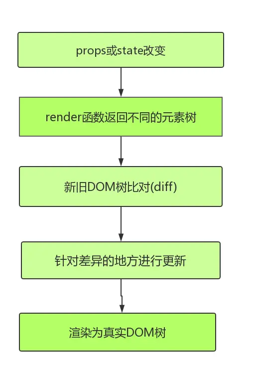

# immutable数据流

## 前置：react Reconciliation及diff策略

### 前置一：Reconciliation

如上图所示，React 采用的是虚拟 DOM (即 VDOM )，每次属性 (props) 和状态 (state) 发生变化的时候，render 函数返回不同的元素树，React 会检测当前返回的元素树和上次渲染的元素树之前的差异，然后针对差异的地方进行更新操作，最后渲染为真实 DOM，这就是整个 Reconciliation 过程，其核心就是进行新旧 DOM 树对比的 diff 算法。

为了获得更优秀的性能，首当其冲的工作便是`减少 diff`的过程，那么在保证应该更新的节点能够得到更新的前提下，这个 diff 的过程如何来避免呢？

答案是利用 shouldComponentUpdate 这个生命周期函数。

## 二、什么是immutable数据

immutable数据

## 三、什么是immutable数据

immutable数据

## 四、什么是immutable数据

immutable数据